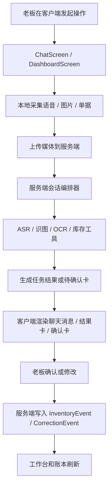

# 01. React Native 架构蓝图

本文件默认以 [00-final-tech-stack.md](./00-final-tech-stack.md) 作为最终技术选型依据。

## 1. 目标

用一套对 React Native 友好的架构，支撑首版 3 个主界面和 6 条主链路：

- 工作台
- 工作群
- 账本
- 语音入库
- 语音查询
- 拍照建档
- 拍照查询
- 进货单 OCR
- 人工纠错

## 2. 已选定的客户端技术栈

本文件只列客户端和客户端直接依赖的核心部分：

- `React Native`
- `TypeScript`
- `Expo Managed + EAS`
- `React Navigation`
- `TanStack Query`
- `Zustand`
- `React Hook Form`
- `Zod`

选择理由：

- `Expo` 降低首版多端和媒体接入成本
- `React Navigation` 足够支撑 3 个主界面和若干底部弹层
- `TanStack Query` 负责服务端数据和缓存
- `Zustand` 负责会话态、输入态、上传态、UI 态
- `React Hook Form + Zod` 适合确认卡和纠错表单

例外：

- 如果后续必须深度接入厂商级语音 SDK、硬件扫码枪或端侧模型能力，可以从 Expo 过渡到 Bare Workflow

## 3. 架构原则

- 按功能域组织，而不是按文件类型组织
- 服务端数据和本地 UI 状态分开管理
- 语音是主入口，多模态是补盲能力
- 客户端不做业务真相源，库存真相始终在服务端
- 所有写操作都必须走确认和审计链

## 4. 客户端模块划分

建议目录：

```text
src/
  app/
    navigation/
    providers/
    bootstrap/
  features/
    dashboard/
      screens/
      components/
      hooks/
    chat/
      screens/
      components/
      hooks/
    inventory/
      api/
      components/
      hooks/
      models/
    ledger/
      screens/
      components/
      hooks/
    media/
      api/
      hooks/
      utils/
    ocr/
      api/
      hooks/
    session/
      api/
      hooks/
      store/
    confirmations/
      components/
      hooks/
  services/
    api/
    auth/
    uploads/
    analytics/
  shared/
    ui/
    utils/
    constants/
    types/
```

## 5. 页面结构

首版导航建议：

```text
RootStack
  BottomTabs
    DashboardScreen
    ChatScreen
    LedgerScreen
  Modal / Sheet
    ConfirmationSheet
    PhotoPreviewSheet
    ReceiptOcrSheet
    CorrectionSheet
    ItemPickerSheet
```

说明：

- 主导航仍然是 3 个一级页面
- 微信感聊天页在 `ChatScreen`
- 确认、OCR 结果、纠错优先做成底部弹层，不新增太多独立页面

## 6. 关键运行链路



## 7. 客户端分层

### 7.1 展示层

- Screen
- Feature Components
- Shared UI

职责：

- 渲染工作台、聊天、账本
- 收集用户输入
- 不直接写业务规则

### 7.2 交互层

- feature hooks
- local stores
- navigation handlers

职责：

- 协调提交语音、拍照、确认、纠错
- 管理展开面板、上传中、待确认等短生命周期状态

### 7.3 数据层

- REST client
- TanStack Query hooks
- upload service

职责：

- 请求接口
- 处理缓存
- 负责重试和错误态映射

## 8. 推荐状态管理边界

### 用 TanStack Query 管的状态

- 工作台指标
- 库存列表
- 低库存提醒
- 会话消息列表
- 审计时间线
- OCR 结果
- 待确认任务详情

### 用 Zustand 管的状态

- 当前聊天输入模式
- 当前选中的媒体草稿
- 工具面板展开状态
- 当前待上传队列
- 当前正在处理的本地录音状态
- 当前打开的确认弹层

## 9. 客户端与服务端职责边界

### 客户端负责

- 采集语音、图片、单据
- 展示消息、结果卡、确认卡
- 提交用户确认和纠错
- 缓存最近列表
- 提供弱网重试和上传队列

### 服务端负责

- 会话编排
- 模型调用
- 商品识别
- OCR 抽取
- 库存查询
- 库存事件写入
- 风控判断
- 审计记录

## 10. React Native 首版组件建议

### 工作台

- `DashboardHero`
- `VoiceEntryCard`
- `PendingTaskCard`
- `LowStockList`

### 工作群

- `ChatHeader`
- `MessageList`
- `MessageBubble`
- `ResultCard`
- `ConfirmationCard`
- `ChatComposer`
- `ToolPanel`

### 账本

- `InventoryList`
- `InventoryItemCard`
- `CorrectionForm`
- `AuditTimeline`

## 11. 首版非功能约束

- 聊天页必须足够接近微信习惯
- 语音入口必须在工作台和聊天页都明显可见
- 图片上传和 OCR 结果要有清晰的处理中状态
- 任何写操作都必须能找到来源任务
- 所有关键错误都要转成用户能理解的话术

## 12. 建议先不做的客户端复杂度

- 离线完整写操作
- 本地数据库级复杂同步
- 多店铺切换
- 多角色独立聊天线程
- 真正实时流式通话
