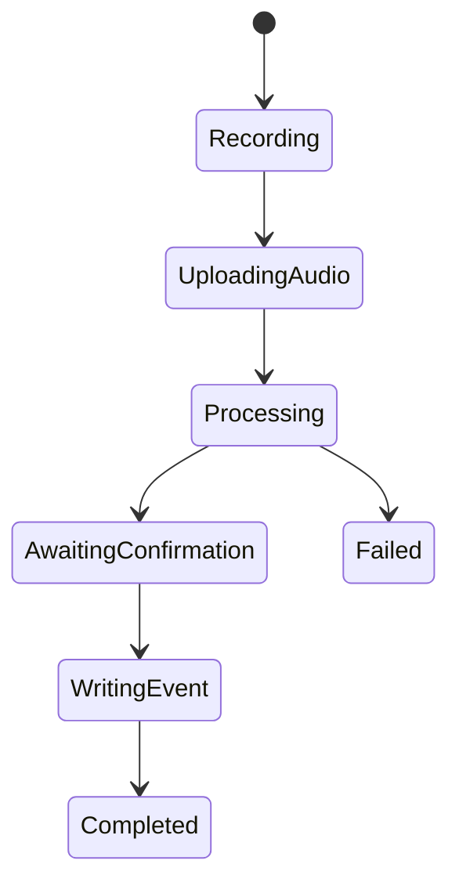
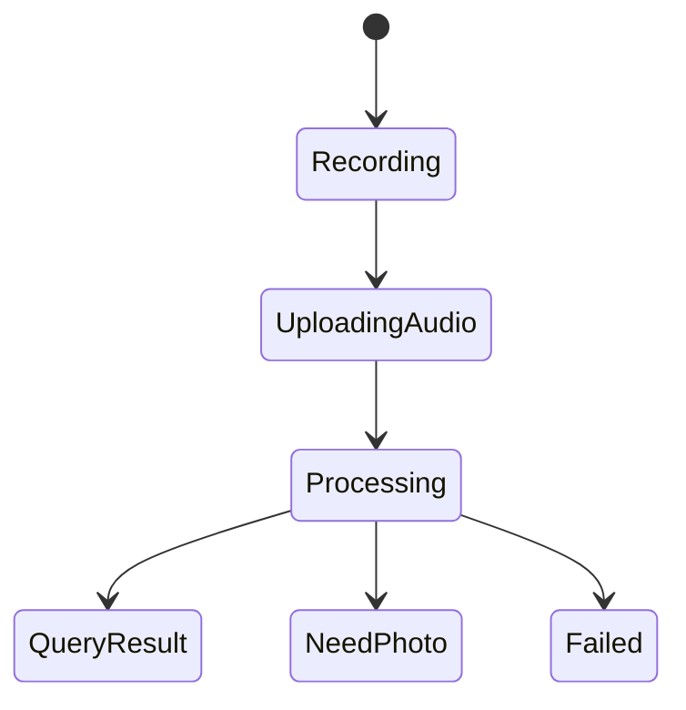

# 04. 客户端状态与流程

## 1. 目标

明确 React Native 客户端页面、状态和交互的运行方式，避免前端实现时把“消息态”“任务态”“确认态”混成一团。

## 2. 三个主页面

### 2.1 DashboardScreen

职责：

- 展示今日指标
- 展示低库存提醒
- 展示待确认任务
- 提供明显语音入口
- 跳转到工作群和账本

### 2.2 ChatScreen

职责：

- 模拟微信式工作群体验
- 承接语音、商品照片、进货单照片
- 展示结果卡、确认卡、OCR 卡

### 2.3 LedgerScreen

职责：

- 查看库存项
- 查看最近库存改动
- 执行人工纠错
- 查看审计时间线

## 3. 客户端关键状态

### 3.1 会话状态

```ts
type ChatUiState = {
  sessionId: string | null
  inputMode: "voice" | "text"
  toolPanelOpen: boolean
  isRecording: boolean
  draftMedia: LocalMediaDraft | null
}
```

### 3.2 任务状态

```ts
type TaskUiState = {
  activeTaskRunId: string | null
  activeConfirmationId: string | null
  submitting: boolean
}
```

### 3.3 账本状态

```ts
type LedgerUiState = {
  selectedItemId: string | null
  correctionSheetOpen: boolean
}
```

## 4. 页面级 Query 列表

### DashboardScreen

- `useDashboardSummaryQuery`
- `useLowStockAlertsQuery`
- `usePendingConfirmationsQuery`

### ChatScreen

- `useSessionBootstrapMutation`
- `useSessionMessagesQuery`
- `useSendMessageMutation`
- `usePendingConfirmationsQuery`

### LedgerScreen

- `useInventoryItemsQuery`
- `useAuditLogsQuery`
- `useCreateCorrectionMutation`

## 5. 六条主流程状态机

### 5.1 语音入库



### 5.2 语音查询



### 5.3 拍照建档

- 采集商品照
- 上传图片
- 服务端识别候选
- 若低置信，则进入确认卡
- 用户确认后才落账

### 5.4 拍照查询

- 采集商品或货架照
- 上传图片
- 返回识别结果
- 叠加库存查询结果
- 只读返回，不落账

### 5.5 进货单 OCR

- 采集单据图
- 上传图片
- OCR 处理
- 返回结构化字段
- 低置信字段高亮
- 用户确认后生成后续入库任务

### 5.6 人工纠错

- 用户选商品
- 填写目标数量
- 填写原因
- 提交 Correction
- 成功后刷新列表与审计

## 6. 推荐交互约束

### 聊天页

- 视觉习惯尽量接近微信
- 输入条优先出现语音入口
- `+` 面板里放拍照建档、拍照查询、进货单 OCR

### 工作台

- 语音按钮必须足够醒目
- 待确认卡必须说人话
- 低库存提醒不要写成复杂运营报表

### 账本

- 纠错入口必须简单
- 修改原因不能省略
- 修正后要给明确回执

## 7. 错误态设计

### 语音失败

- 文案：`这段语音我没听清，您可以再说一遍，或者改成文字。`

### 识图低置信

- 文案：`我大概认出来了，但不敢直接入账，麻烦您确认一下。`

### OCR 失败

- 文案：`这张单据我没读清，建议重新拍一张更平整的照片。`

### 写库冲突

- 文案：`这条库存刚刚被更新过，我已经帮您刷新到最新结果。`

## 8. 客户端埋点建议

首版最值得埋的事件：

- `voice_entry_tapped`
- `voice_task_submitted`
- `voice_task_completed`
- `voice_query_submitted`
- `photo_stock_in_submitted`
- `photo_query_submitted`
- `receipt_ocr_submitted`
- `confirmation_approved`
- `confirmation_rejected`
- `correction_submitted`

## 9. 首版验收标准

- 工作台到工作群跳转顺畅
- 聊天页可承接语音、图片、单据三类输入
- 六条链路都有完整 UI 回路
- 所有写操作都能在账本和审计中找到

