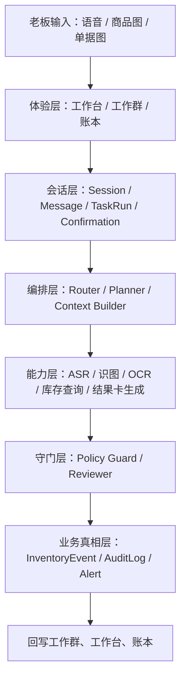

# 07. AI 员工设计与 AI 原生系统设计

## 1. 这份文档解决什么问题

当前产品已经明确了：

- 语音优先
- 多模态辅助
- 微信式工作群体验
- FastAPI 作为后端编排中心

但还缺一件非常关键的事：

**AI 员工到底应该怎么设计，系统底层又该如何真正“AI 原生”，而不是只是在 App 里套一个聊天框。**

这份文档的目标，就是把这件事讲清楚。

## 2. 我从“Claude Code / agent-first”里借了什么

虽然当前工作区里没有一个明确叫 `claw-code` 的本地目录，但从你当前项目上下文里最接近、最值得借的其实是这套设计思想：

- 一个系统不应该只有一个“大模型黑箱”
- 不同任务需要不同角色边界
- 角色不等于工具
- 工具不等于流程
- 高风险动作前必须有守门机制
- 长任务必须可追踪、可恢复、可审计
- 用户看到的是“自然协作”，系统内部运行的是“可控编排”

如果把这套思想翻译成你的产品语言，就是：

- **老板看到的是员工**
- **系统内部运行的是调度器、能力包、工具链、守门规则和账本事件**

## 3. AI 员工到底是什么

### 3.1 AI 员工不是“多开几个模型”

AI 员工不应该被理解成：

- 每个员工一个独立模型实例
- 每个员工都能随便调用所有能力
- 员工之间自由聊天、自由改数据

正确理解应该是：

**AI 员工是一个“角色合同（Role Contract）”，不是一个自由失控的模型人格。**

这个合同至少包含：

- 角色名称
- 用户可见人设
- 负责的业务域
- 可以调用的 Skill
- 可以调用的 Tool
- 禁止越界的动作
- 遇到什么情况必须确认
- 可以把任务转给谁
- 成功回执怎么说
- 失败或不确定时怎么说

### 3.2 角色合同比人格更重要

对于你这个产品，人设确实重要，因为它影响：

- 用户是否愿意长期使用
- 群聊调度是否有拟人感
- 是否符合“老板在群里吩咐”的心智

但比人设更重要的是边界。

因为如果边界不清楚：

- 小雅可能既聊天又乱改库存
- 老李可能既识图又瞎解释利润
- 一个看似“很聪明”的员工，会让系统变得不可预测

## 4. 你的 AI 员工应该怎么设计

## 4.1 先分成两类：前台员工 vs 后台系统员工

### 前台员工

这是用户能看见、能感知、能在工作群里互动的角色。

首版建议：

- **小雅**
  - 唯一前台入口
  - 负责接收老板输入、理解意图、解释结果、发起确认、组织回执
- **老李**
  - 库存执行岗
  - 负责库存域任务：入库、查库存、低库存提醒、拍照建档辅助

后续再加：

- **小丽**
  - 查询和经营解释岗
  - 负责更复杂的流水、利润差异、经营问答

### 后台系统员工

这类角色不一定暴露给用户，但系统内部应该存在。

建议首版就有以下“隐形角色”：

- **Router / Planner**
  - 判断当前任务是什么，是否需要多步处理
- **Context Builder**
  - 组装当前店铺、商品、规则、会话上下文
- **Policy Guard**
  - 判断是否必须确认、是否可直接写库
- **Tool Runner**
  - 真正执行识图、OCR、库存查询、库存写入
- **Reviewer**
  - 在高风险链路里做最后一层质量拦截
- **Summarizer**
  - 负责把长任务和长会话压成摘要

**结论：**

- 用户看到 2 个员工就够了
- 系统内部可以有 5 到 6 个运行角色

这才是“AI 原生系统”，而不是“多开几个聊天机器人”。

## 4.2 MVP 阶段最合理的员工设计

### 小雅：首席调度助理

#### 用户感知角色

- 温和、能理解老板说话方式
- 像微信群里的主协调人
- 不炫技，不讲太多系统术语

#### 系统职责

- 接收语音 / 图片 / 单据输入
- 判断任务是：
  - 语音入库
  - 语音查询
  - 拍照建档
  - 拍照查询
  - 进货单 OCR
  - 人工纠错回执
- 决定是否转给老李
- 决定是否生成确认卡
- 决定如何向老板解释

#### 不应该做的事

- 直接写库存
- 直接修改价格
- 越过确认链
- 随意回答账本真相

### 老李：库存执行岗

#### 用户感知角色

- 办事靠谱
- 少说空话
- 回复短而明确

#### 系统职责

- 处理库存域结果
- 整理识图和 OCR 结果
- 生成库存结果卡
- 生成低库存建议
- 接受确认后的正式入库动作

#### 不应该做的事

- 接管所有对话
- 做开放式经营分析
- 对不确定的商品强行落账

## 4.3 后续员工该怎么加

你后面一定会想加更多员工，但建议按下面顺序：

### Phase 1 后可加

- **小丽**
  - 只做经营查询和解释

### Phase 2 后可加

- **老赵**
  - 财务与对账相关

### Phase 3 平台化后可加

- 供应商建议岗
- 促销建议岗
- 盘点协同岗

原则是：

**不是“哪里能加员工就加员工”，而是“当某个域已经复杂到需要独立边界时，再加一个角色”。**

## 5. 你的 AI 员工配置模型应该长什么样

建议把每个员工定义成一个结构化对象，而不是散落在 Prompt 里。

```ts
type EmployeeProfile = {
  employee_id: string
  visible_name: string
  role: string
  visible_to_user: boolean
  persona: {
    tone: string
    style: string
    response_length: "short" | "medium"
  }
  domain_scope: string[]
  skill_ids: string[]
  tool_ids: string[]
  disallowed_actions: string[]
  confirmation_rules: string[]
  handoff_targets: string[]
  memory_scope: "session" | "shop" | "task"
}
```

## 6. 你的 AI 原生系统应该怎么设计

## 6.1 四层结构最适合你

### 第一层：体验层

用户能看见的部分：

- 工作台
- 工作群
- 账本
- 结果卡
- 确认卡

### 第二层：会话与任务层

这层是你产品真正的“AI OS 壳”：

- ConversationSession
- SessionMessage
- TaskRun
- Confirmation

它解决的问题是：

- 当前老板在做什么
- 当前任务进到哪一步了
- 现在是在查、在写、还是在等确认

### 第三层：能力编排层

这层是系统中最接近 “Claude Code 启发” 的部分。

包含：

- Router / Planner
- Context Builder
- Policy Guard
- Tool Runner
- Reviewer
- Summarizer

这层决定：

- 先做什么
- 后做什么
- 哪一步需要人确认
- 哪一步可以自动继续

### 第四层：业务真相层

这层是最终不能乱的部分：

- InventoryItem
- InventoryEvent
- AuditLog
- Alert
- OcrDocument

这层的规则是：

- 不允许模型直接改
- 只能通过工具和事件写入

## 6.2 推荐的 AI 原生系统总图



## 6.3 这套系统和普通 App + Chat 的区别

普通做法：

- 用户发一句话
- LLM 回一句
- 某些接口被调用

你的目标做法：

- 用户发一句话
- 系统识别成任务
- 任务进入状态机
- 根据能力和规则分配执行路径
- 结果通过结果卡和确认卡回到用户
- 所有关键动作都留痕

这才叫“AI 原生系统”，因为：

- AI 不只是回答
- AI 真正驱动了系统流程
- 系统又反过来约束了 AI

## 7. 你最该借鉴的不是“多智能体”，而是“控制平面”

从 agent-first 思路里，你最该借的是：

### 7.1 角色和能力分离

- 员工 = 角色
- Skill = 业务能力
- Tool = 原子动作

### 7.2 执行前要计划

- 先识别任务
- 再判断缺什么信息
- 再决定是否需要确认

### 7.3 执行后要回执

- 不是“做了就算”
- 必须把结果、风险和下一步清楚地回给老板

### 7.4 高风险动作要复核

- 不让模型直接成为业务真相的最后写入者

### 7.5 长链路要可追踪

- 一个任务从语音到识图到确认到写账，必须全程能追踪

## 8. 面向产品的具体建议

### 8.1 用户看到的员工要少

建议首版只让用户稳定感知：

- 小雅
- 老李

不要一开始就让用户看到 5 个员工。

因为用户不是来管理一个 AI 公司组织架构图的。

### 8.2 系统内部的角色要多

建议首版内部就分清：

- 规划
- 上下文
- 执行
- 守门
- 总结

这样你的产品后面扩展时不会变成“大 Prompt 糊在一起”。

### 8.3 所有员工都要有越界边界

例如：

- 小雅不能直接写库存
- 老李不能绕过确认规则
- OCR 结果不能直接批量入账

### 8.4 可商业化的不是“角色名”，而是“能力包”

未来真正能卖的不是单纯“多一个员工头像”，而是：

- 更强 OCR
- 更强拍照查询
- 更复杂经营分析
- 更完整供应链建议

也就是说：

- 角色是入口
- 能力包才是商品

## 9. 当前最推荐的落地路线

### MVP

- 用户可见：小雅、老李
- 系统内部：Router / Guard / Runner / Summarizer

### MVP+1

- 引入小丽做经营解释
- 强化 OCR 和拍照查询

### 平台化阶段

- 引入角色包和能力包市场
- 支持官方扩展员工

## 10. 最终结论

你的 AI 员工设计，不应该停留在“给几个名字和人设”。

真正高价值的设计应该是：

- 对用户来说：像在微信里指挥两个靠谱员工
- 对系统来说：是一个由会话、任务、能力、守门、审计构成的 AI 原生操作系统

一句话总结：

**员工是前台人格，系统是后台控制平面；前台要少而稳，后台要清晰而可控。**

